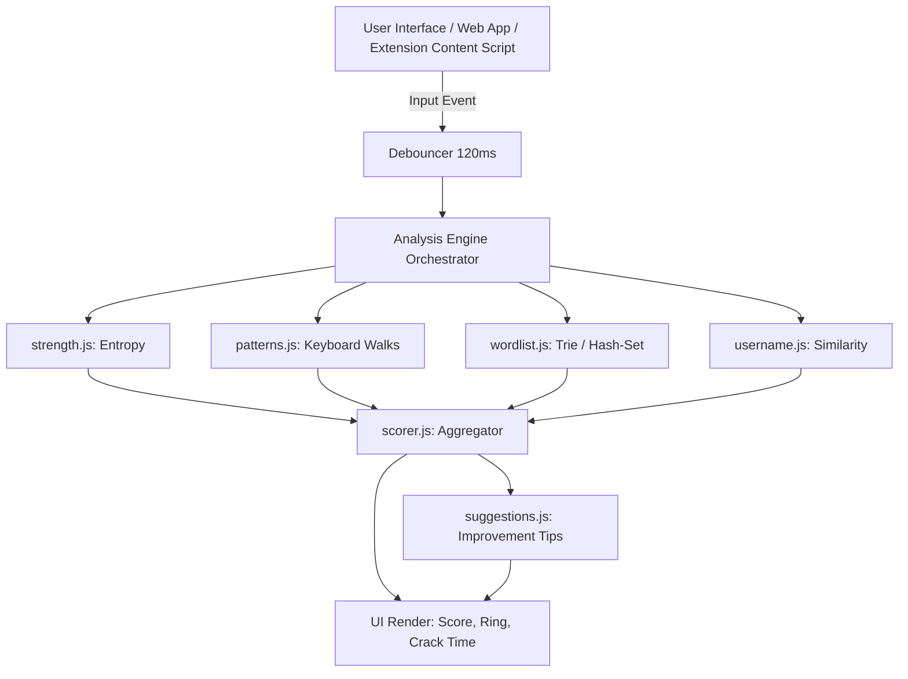
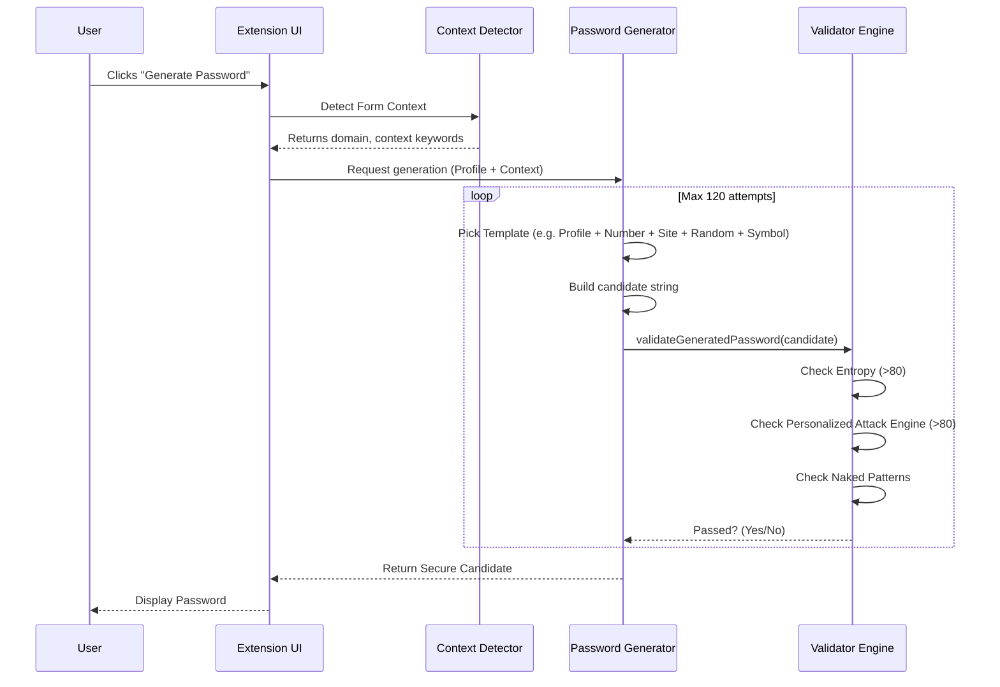
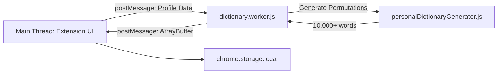

# 📐 System Design

This document details the high-level and low-level system design of the Password Strength Analyzer.

> **[AI Prompt: System Design Visual]**  
> *Prompt: "A sleek technical blueprint of a software system. White lines on a dark blueprint background showing data flowing from a user input node through various processing filters (Entropy, Patterns, Dictionary) into a final scoring algorithm."*

## High-Level Design (HLD)

The system operates as a pure client-side application. The data never leaves the user's browser context.

## Low-Level Design (LLD): Context-Aware Generator

The Context-Aware Generator is a sophisticated pipeline ensuring generated passwords are both personal and highly secure.

## Data Flow: Web Worker Dictionary Generation

Generating personalized attack dictionaries is computationally expensive. It is offloaded to a Web Worker.

## Storage Architecture

Because the project relies on zero-backend architecture, it relies on Chrome Storage APIs carefully partitioned by sensitivity.

1.  **`chrome.storage.sync`**: Used for non-sensitive extension settings (e.g., default password length, dark mode preference).
2.  **`chrome.storage.local`**: Used for sensitive profile data (names, pets, dates). This data is kept strictly on the local device.
3.  **Hashed Reuse Signatures**: When a user generates a password, its plaintext is **never** saved. Instead, a SHA-256 hash representation of its features is stored to prevent cross-domain reuse.
