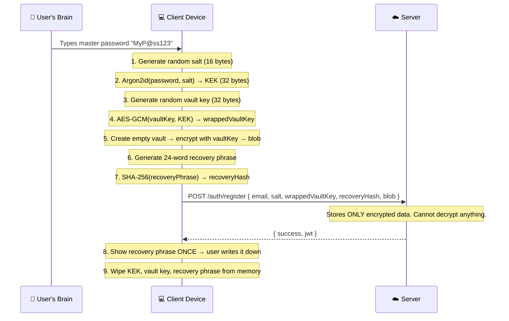
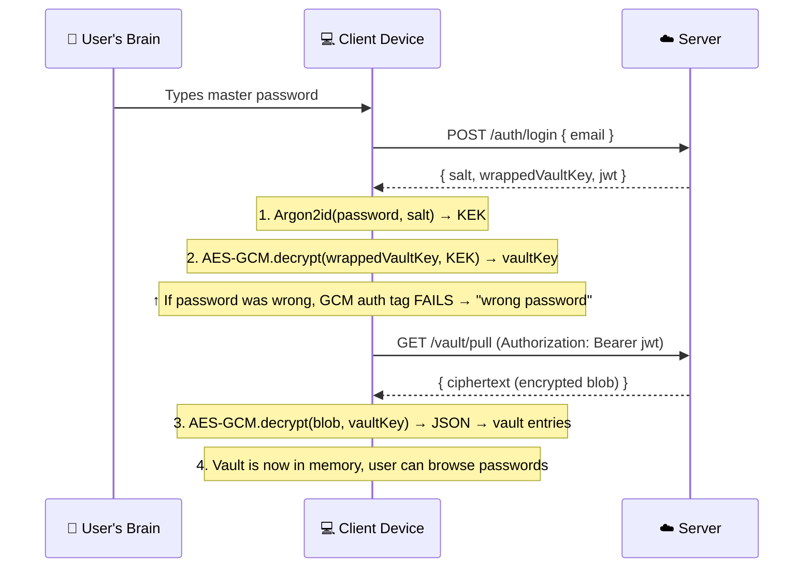
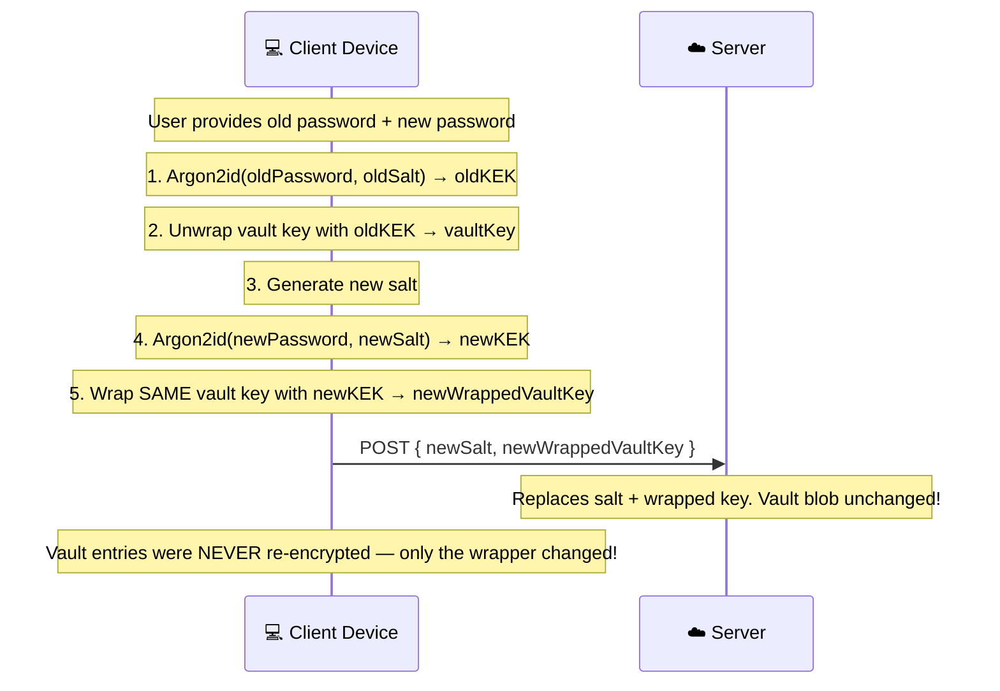

# 🔐 VaultZero — Complete Project Analysis & Deep Dive

> **Project**: Zero-knowledge password manager  
> **Author**: Sanskar ([GitHub](https://github.com/Sanskar-bot/VaultZero))  
> **Start Date**: June 6, 2026  
> **Planned Duration**: 14 days  
> **Current Day**: Day 2 (partially complete)

---

## Table of Contents

1. [What is VaultZero?](#1-what-is-vaultzero)
2. [Why Zero-Knowledge Matters](#2-why-zero-knowledge-matters)
3. [The Encryption Architecture (Tutorial)](#3-the-encryption-architecture-tutorial)
4. [Monorepo Structure Explained](#4-monorepo-structure-explained)
5. [Completion Status — File-by-File Audit](#5-completion-status--file-by-file-audit)
6. [Overall Progress Dashboard](#6-overall-progress-dashboard)
7. [The Complete Data Flow](#7-the-complete-data-flow)
8. [How Every Module Connects](#8-how-every-module-connects)
9. [Cryptography Concepts Explained](#9-cryptography-concepts-explained)
10. [The 14-Day Roadmap — Detailed Breakdown](#10-the-14-day-roadmap--detailed-breakdown)
11. [Security Rules & Why They Matter](#11-security-rules--why-they-matter)
12. [Tech Stack Deep Dive](#12-tech-stack-deep-dive)
13. [Database Schema Explained](#13-database-schema-explained)
14. [API Design Explained](#14-api-design-explained)
15. [What Needs to Happen Next](#15-what-needs-to-happen-next)

---

## 1. What is VaultZero?

VaultZero is a **zero-knowledge password manager**. Think of it like Bitwarden or 1Password, but with one absolute rule:

> **The server NEVER sees your passwords in readable form. Ever.**

Your master password never leaves your brain (and briefly, your device's RAM). Everything is encrypted on YOUR device before it touches the internet. The server is just a dumb storage locker for encrypted blobs it can't read.

### Platforms Planned

| Platform | Technology | Status |
|----------|-----------|--------|
| Crypto Core Library | TypeScript + libsodium + Web Crypto | ✅ ~85% done |
| Backend API Server | Node.js + Express + Prisma + PostgreSQL | 📁 Scaffolded only |
| Browser Extension | React + Manifest V3 (Chrome/Firefox) | 📁 Scaffolded only |
| Web Dashboard | React + Vite + React Router | 📁 Scaffolded only |
| Android App | Kotlin + Jetpack Compose + Android Keystore | 📁 Scaffolded only |
| iOS App | Swift + SwiftUI + CryptoKit + Keychain | 📁 Scaffolded only |

---

## 2. Why Zero-Knowledge Matters

### Traditional Password Manager (e.g., a basic server-side app)
```
You → send password → Server encrypts it → Server stores it
                        ↑ SERVER HAS YOUR PASSWORD IN MEMORY
```
**Problem**: If the server is hacked, breached, or a rogue employee peeks — all your passwords are exposed.

### Zero-Knowledge Password Manager (VaultZero)
```
You → encrypt password ON YOUR DEVICE → send encrypted blob → Server stores blob
                                                                ↑ SERVER SEES GIBBERISH
```
**Key insight**: The server literally _cannot_ decrypt your data. Even if someone steals the entire database, they get a pile of random-looking bytes. Without your master password (which only exists in your brain), the data is useless.

### Real-world analogy
Imagine giving a bank a locked safe to store. The bank keeps the safe but has no key. If someone robs the bank, they get your safe — but they still can't open it. **You hold the only key (your master password).**

---

## 3. The Encryption Architecture (Tutorial)

This is the heart of VaultZero. Let's walk through every layer.

### The Key Hierarchy

```
┌─────────────────────────────────────────────────────────────┐
│                    YOUR BRAIN                               │
│              Master Password: "MyS3cur3P@ss!"               │
└────────────────────┬────────────────────────────────────────┘
                     │
                     ▼
┌─────────────────────────────────────────────────────────────┐
│            STEP 1: KEY DERIVATION (Argon2id)                │
│                                                             │
│  Input:  "MyS3cur3P@ss!" + random salt (16 bytes)          │
│  Params: 64 MiB memory, 3 iterations, 1 thread             │
│  Output: KEK (Key Encryption Key) — 32 random-looking bytes│
│                                                             │
│  Purpose: Turn your human-memorable password into a         │
│           cryptographic key that's exactly 32 bytes long    │
└────────────────────┬────────────────────────────────────────┘
                     │
                     ▼
┌─────────────────────────────────────────────────────────────┐
│            STEP 2: KEY WRAPPING (AES-256-GCM)               │
│                                                             │
│  The KEK encrypts ("wraps") the Vault Key:                  │
│  wrappedVaultKey = AES-GCM(vaultKey, KEK)                  │
│                                                             │
│  The WRAPPED vault key is stored on the server.             │
│  The server CAN'T unwrap it — needs the KEK, which         │
│  requires the master password, which never left your brain. │
└────────────────────┬────────────────────────────────────────┘
                     │
                     ▼
┌─────────────────────────────────────────────────────────────┐
│         STEP 3: VAULT ENCRYPTION (AES-256-GCM)             │
│                                                             │
│  The (unwrapped) Vault Key encrypts your actual passwords:  │
│  blob = AES-GCM(JSON.stringify(allPasswords), vaultKey)    │
│                                                             │
│  This encrypted blob is what gets sent to the server.       │
│  Fresh random IV (12 bytes) per encryption — CRITICAL.      │
└─────────────────────────────────────────────────────────────┘
```

### Why Three Layers?

> [!IMPORTANT]
> **Why not just encrypt passwords directly with the master password?**

If you encrypted passwords directly with a key derived from your master password, then **changing your master password would require re-encrypting your entire vault** (which could be hundreds of entries). With the 3-layer design:

1. Change master password → derive new KEK → re-wrap the SAME vault key → done in milliseconds
2. The vault key stays the same — no need to re-encrypt hundreds of entries
3. Recovery phrase can derive an ALTERNATIVE KEK to unwrap the same vault key

---

## 4. Monorepo Structure Explained

VaultZero uses **npm workspaces** — one root `package.json` manages multiple sub-packages.

```
VaultZero/                          ← Root (npm workspace manager)
├── package.json                    ← Defines workspaces: core, backend, extension, web
│
├── core/                           ← @vaultzero/core — THE CRYPTO ENGINE
│   ├── src/crypto/                 ← Argon2id, AES-GCM, Key wrapping, Password generator
│   ├── src/vault/                  ← Vault types + CRUD operations
│   ├── src/recovery/               ← BIP39 recovery phrase (NOT YET IMPLEMENTED)
│   ├── src/utils/                  ← Base64/Hex/UTF-8 encoding helpers
│   └── src/__tests__/              ← Jest unit tests (8 tests passing)
│
├── backend/                        ← @vaultzero/backend — THE API SERVER
│   ├── prisma/schema.prisma        ← Database schema (5 models, fully designed)
│   ├── src/config/                 ← Environment variable validation (stub)
│   ├── src/middleware/             ← JWT auth + rate limiting (stubs)
│   ├── src/routes/                 ← Auth, vault, audit endpoints (stubs)
│   ├── src/services/               ← Business logic layer (stubs)
│   └── src/utils/                  ← JWT sign/verify helpers (stub)
│
├── extension/                      ← @vaultzero/extension — BROWSER EXTENSION
│   ├── manifest.json               ← Manifest V3 (fully configured)
│   ├── esbuild.config.mjs          ← Build config for 3 bundles
│   ├── src/background/             ← Service worker + vault manager (stubs)
│   ├── src/content/                ← Form detection + autofill (stubs)
│   ├── src/popup/                  ← React popup UI (stubs)
│   └── src/shared/                 ← Message types + interfaces (IMPLEMENTED)
│
├── web/                            ← @vaultzero/web — WEB DASHBOARD
│   ├── vite.config.ts              ← Vite configuration (configured)
│   └── src/                        ← React app (stubs)
│
└── mobile/
    ├── android/                    ← Kotlin + Jetpack Compose (scaffold)
    └── ios/                        ← Swift + SwiftUI (scaffold)
```

### How workspaces connect

```
@vaultzero/core        ← depends on nothing (standalone crypto library)
@vaultzero/backend     ← depends on @vaultzero/core (imports types only)
@vaultzero/extension   ← depends on @vaultzero/core (imports ALL crypto)
@vaultzero/web         ← depends on @vaultzero/core (imports ALL crypto)
mobile/android         ← reimplements crypto natively (Android Keystore)
mobile/ios             ← reimplements crypto natively (CryptoKit)
```

---

## 5. Completion Status — File-by-File Audit

### Legend
- ✅ **IMPLEMENTED** — Working code with real logic
- 📝 **DESIGNED** — Has detailed docstrings/comments but code is TODO
- 📁 **SCAFFOLDED** — File exists with placeholder comments only
- ❌ **MISSING** — File doesn't exist yet

---

### 📦 `core/` — Crypto Core Library

| File | Status | Lines | Description |
|------|--------|-------|-------------|
| [index.ts](file:///s:/Personal%20Projects/VaultZero/core/src/index.ts) | ✅ IMPLEMENTED | 23 | Barrel export for all modules |
| [crypto/index.ts](file:///s:/Personal%20Projects/VaultZero/core/src/crypto/index.ts) | ✅ IMPLEMENTED | 5 | Re-exports all crypto modules |
| [crypto/argon2.ts](file:///s:/Personal%20Projects/VaultZero/core/src/crypto/argon2.ts) | ✅ IMPLEMENTED | 129 | `deriveKEK()` + `generateSalt()` — full Argon2id with libsodium |
| [crypto/aes-gcm.ts](file:///s:/Personal%20Projects/VaultZero/core/src/crypto/aes-gcm.ts) | ✅ IMPLEMENTED | 178 | `encryptData()` + `decryptData()` — full AES-256-GCM with Web Crypto |
| [crypto/keys.ts](file:///s:/Personal%20Projects/VaultZero/core/src/crypto/keys.ts) | ✅ IMPLEMENTED | 136 | `generateVaultKey()` + `wrapVaultKey()` + `unwrapVaultKey()` |
| [crypto/generator.ts](file:///s:/Personal%20Projects/VaultZero/core/src/crypto/generator.ts) | ✅ IMPLEMENTED | 209 | `generatePassword()` + `calculateEntropy()` + `checkBreach()` |
| [vault/index.ts](file:///s:/Personal%20Projects/VaultZero/core/src/vault/index.ts) | ✅ IMPLEMENTED | 2 | Re-exports vault modules |
| [vault/types.ts](file:///s:/Personal%20Projects/VaultZero/core/src/vault/types.ts) | ✅ IMPLEMENTED | 54 | `VaultEntry`, `VaultStore`, `EncryptedVault` interfaces |
| [vault/vault.ts](file:///s:/Personal%20Projects/VaultZero/core/src/vault/vault.ts) | ✅ IMPLEMENTED | 201 | `createVault()`, `addEntry()`, `updateEntry()`, `deleteEntry()`, `searchEntries()`, `getEntriesForUrl()` |
| [recovery/index.ts](file:///s:/Personal%20Projects/VaultZero/core/src/recovery/index.ts) | 📁 SCAFFOLDED | 1 | Empty export |
| [recovery/bip39.ts](file:///s:/Personal%20Projects/VaultZero/core/src/recovery/bip39.ts) | 📝 DESIGNED | 32 | Has detailed docstring but only TODOs — 3 functions needed |
| [utils/index.ts](file:///s:/Personal%20Projects/VaultZero/core/src/utils/index.ts) | ✅ IMPLEMENTED | 1 | Re-exports encoding |
| [utils/encoding.ts](file:///s:/Personal%20Projects/VaultZero/core/src/utils/encoding.ts) | ✅ IMPLEMENTED | 61 | `toBase64()`, `fromBase64()`, `toHex()`, `fromHex()`, `utf8Encode()`, `utf8Decode()` |
| [__tests__/crypto.test.ts](file:///s:/Personal%20Projects/VaultZero/core/src/__tests__/crypto.test.ts) | ✅ IMPLEMENTED | 167 | 8 unit tests for AES-GCM, key wrapping, password gen, entropy |

**Core Completion: ~85%** (only `recovery/bip39.ts` remains)

---

### 📦 `backend/` — API Server

| File | Status | Lines | Description |
|------|--------|-------|-------------|
| [prisma/schema.prisma](file:///s:/Personal%20Projects/VaultZero/backend/prisma/schema.prisma) | ✅ IMPLEMENTED | 103 | 5 models: User, VaultBlob, Device, AuditLog, RefreshToken — fully designed |
| [src/index.ts](file:///s:/Personal%20Projects/VaultZero/backend/src/index.ts) | 📝 DESIGNED | 16 | Pseudocode for server startup |
| [src/app.ts](file:///s:/Personal%20Projects/VaultZero/backend/src/app.ts) | 📝 DESIGNED | 16 | Describes middleware + factory pattern |
| [src/config/index.ts](file:///s:/Personal%20Projects/VaultZero/backend/src/config/index.ts) | 📝 DESIGNED | 12 | Describes zod env validation |
| [src/middleware/auth.ts](file:///s:/Personal%20Projects/VaultZero/backend/src/middleware/auth.ts) | 📝 DESIGNED | 11 | Describes JWT verification middleware |
| [src/middleware/rate-limit.ts](file:///s:/Personal%20Projects/VaultZero/backend/src/middleware/rate-limit.ts) | 📝 DESIGNED | 14 | Describes login + general rate limits |
| [src/routes/auth.ts](file:///s:/Personal%20Projects/VaultZero/backend/src/routes/auth.ts) | 📝 DESIGNED | 16 | Describes 4 auth endpoints |
| [src/routes/vault.ts](file:///s:/Personal%20Projects/VaultZero/backend/src/routes/vault.ts) | 📝 DESIGNED | 14 | Describes pull/push endpoints |
| [src/routes/audit.ts](file:///s:/Personal%20Projects/VaultZero/backend/src/routes/audit.ts) | 📝 DESIGNED | 10 | Describes audit log endpoint |
| [src/routes/api.test.ts](file:///s:/Personal%20Projects/VaultZero/backend/src/routes/api.test.ts) | 📁 SCAFFOLDED | ~15 | Test stubs |
| [src/services/auth.service.ts](file:///s:/Personal%20Projects/VaultZero/backend/src/services/auth.service.ts) | 📝 DESIGNED | 8 | Describes register/login/refresh/logout |
| [src/services/vault.service.ts](file:///s:/Personal%20Projects/VaultZero/backend/src/services/vault.service.ts) | 📝 DESIGNED | 8 | Describes pullVault/pushVault |
| [src/services/audit.service.ts](file:///s:/Personal%20Projects/VaultZero/backend/src/services/audit.service.ts) | 📝 DESIGNED | 8 | Describes logEvent/getRecentEvents |
| [src/utils/jwt.ts](file:///s:/Personal%20Projects/VaultZero/backend/src/utils/jwt.ts) | 📝 DESIGNED | 12 | Describes JWT token structure |
| [.env.example](file:///s:/Personal%20Projects/VaultZero/backend/.env.example) | ✅ IMPLEMENTED | — | Environment variable template |

**Backend Completion: ~10%** (Prisma schema done + all files designed but NO working code)

---

### 📦 `extension/` — Browser Extension

| File | Status | Lines | Description |
|------|--------|-------|-------------|
| [manifest.json](file:///s:/Personal%20Projects/VaultZero/extension/manifest.json) | ✅ IMPLEMENTED | 43 | Full Manifest V3 config with permissions, CSP, icons |
| [popup.html](file:///s:/Personal%20Projects/VaultZero/extension/popup.html) | ✅ IMPLEMENTED | — | HTML shell for popup |
| [esbuild.config.mjs](file:///s:/Personal%20Projects/VaultZero/extension/esbuild.config.mjs) | ✅ IMPLEMENTED | — | 3-bundle build config |
| [src/shared/messages.ts](file:///s:/Personal%20Projects/VaultZero/extension/src/shared/messages.ts) | ✅ IMPLEMENTED | 34 | `MessageType` enum (12 message types) + `ExtensionMessage` interface |
| [src/shared/types.ts](file:///s:/Personal%20Projects/VaultZero/extension/src/shared/types.ts) | ✅ IMPLEMENTED | 12 | `PopupState` interface |
| [src/background/service-worker.ts](file:///s:/Personal%20Projects/VaultZero/extension/src/background/service-worker.ts) | 📝 DESIGNED | 17 | Describes responsibilities (stub) |
| [src/background/vault-manager.ts](file:///s:/Personal%20Projects/VaultZero/extension/src/background/vault-manager.ts) | 📝 DESIGNED | 15 | Describes VaultManager class (stub) |
| [src/content/content-script.ts](file:///s:/Personal%20Projects/VaultZero/extension/src/content/content-script.ts) | 📝 DESIGNED | 22 | Describes form detection + autofill (stub) |
| [src/content/form-detector.ts](file:///s:/Personal%20Projects/VaultZero/extension/src/content/form-detector.ts) | 📝 DESIGNED | — | Login form heuristics (stub) |
| [src/content/phishing-check.ts](file:///s:/Personal%20Projects/VaultZero/extension/src/content/phishing-check.ts) | 📝 DESIGNED | — | Levenshtein hostname check (stub) |
| [src/popup/App.tsx](file:///s:/Personal%20Projects/VaultZero/extension/src/popup/App.tsx) | 📝 DESIGNED | 13 | Describes screen navigation (stub) |
| [src/popup/index.tsx](file:///s:/Personal%20Projects/VaultZero/extension/src/popup/index.tsx) | 📁 SCAFFOLDED | — | React entry point (stub) |
| [src/popup/components/*.tsx](file:///s:/Personal%20Projects/VaultZero/extension/src/popup/components) | 📁 SCAFFOLDED | — | LockScreen, VaultList, EntryForm, PasswordGenerator, SearchBar |

**Extension Completion: ~15%** (config + types done, all logic is stubs)

---

### 📦 `web/` — Web Dashboard

| File | Status | Lines | Description |
|------|--------|-------|-------------|
| [index.html](file:///s:/Personal%20Projects/VaultZero/web/index.html) | ✅ IMPLEMENTED | — | HTML shell |
| [vite.config.ts](file:///s:/Personal%20Projects/VaultZero/web/vite.config.ts) | ✅ IMPLEMENTED | — | Vite configuration |
| [src/App.tsx](file:///s:/Personal%20Projects/VaultZero/web/src/App.tsx) | 📝 DESIGNED | 15 | Describes 5 pages (stub) |
| [src/main.tsx](file:///s:/Personal%20Projects/VaultZero/web/src/main.tsx) | 📝 DESIGNED | 12 | React entry point (stub) |
| [src/components/.gitkeep](file:///s:/Personal%20Projects/VaultZero/web/src/components) | 📁 SCAFFOLDED | — | Empty directory placeholder |
| [src/pages/.gitkeep](file:///s:/Personal%20Projects/VaultZero/web/src/pages) | 📁 SCAFFOLDED | — | Empty directory placeholder |
| [src/styles/index.css](file:///s:/Personal%20Projects/VaultZero/web/src/styles) | 📁 SCAFFOLDED | — | CSS placeholder |

**Web Completion: ~5%** (just build config, no working UI)

---

### 📱 `mobile/` — Android + iOS

| Component | Status | Description |
|-----------|--------|-------------|
| Android Gradle configs | ✅ IMPLEMENTED | `build.gradle.kts` + `settings.gradle.kts` |
| Android Manifest | ✅ IMPLEMENTED | `AndroidManifest.xml` with autofill service |
| Android source files | 📁 SCAFFOLDED | 5 Kotlin files — all stubs |
| iOS project files | 📁 SCAFFOLDED | `Info.plist` + 4 Swift files — all stubs |

**Mobile Completion: ~5%** (just project scaffolding)

---

## 6. Overall Progress Dashboard

```
┌──────────────────────────────────────────────────────────────────┐
│                    OVERALL PROJECT PROGRESS                      │
│                                                                  │
│  Core Crypto    ████████████████████░░░░  85%  ← ALMOST DONE    │
│  Backend API    ██░░░░░░░░░░░░░░░░░░░░░░  10%  ← Schema only   │
│  Extension      ███░░░░░░░░░░░░░░░░░░░░░  15%  ← Config + types│
│  Web Dashboard  █░░░░░░░░░░░░░░░░░░░░░░░   5%  ← Build only    │
│  Android App    █░░░░░░░░░░░░░░░░░░░░░░░   5%  ← Scaffold      │
│  iOS App        █░░░░░░░░░░░░░░░░░░░░░░░   5%  ← Scaffold      │
│                                                                  │
│  ─────────────────────────────────────────────                   │
│  TOTAL PROJECT  ████░░░░░░░░░░░░░░░░░░░░  ~20%                  │
│                                                                  │
│  Day 1: ✅ DONE    Day 2: ~75% done    Days 3-14: ⬜ NOT STARTED│
└──────────────────────────────────────────────────────────────────┘
```

### What's Actually Working (Runnable Today)

1. ✅ You can derive a KEK from a master password with Argon2id
2. ✅ You can encrypt/decrypt arbitrary data with AES-256-GCM
3. ✅ You can generate, wrap, and unwrap vault keys
4. ✅ You can generate secure passwords with configurable charsets
5. ✅ You can calculate password entropy
6. ✅ You can check passwords against the Have I Been Pwned database
7. ✅ You can create vaults, add/edit/delete entries, search, and match by URL
8. ✅ You can run 8 unit tests and they all pass
9. ✅ The Prisma schema is designed and client is generated

### What's NOT Working Yet

- ❌ No backend server runs — everything is stubs
- ❌ No web UI renders — stubs
- ❌ No browser extension loads — stubs
- ❌ No mobile app compiles — stubs
- ❌ No recovery phrase generation — TODO
- ❌ No vault serialization/deserialization to encrypted blobs (the `encryptVault`/`decryptVault` functions are not in vault.ts — vault.ts only does CRUD)
- ❌ No end-to-end integration between any modules

---

## 7. The Complete Data Flow

### Flow 1: User Registration



### Flow 2: User Login



### Flow 3: Autofill in Browser Extension

```mermaid
sequenceDiagram
    participant Page as 🌐 Web Page
    participant Content as 📝 Content Script
    participant BG as 🔒 Service Worker
    participant Server as ☁️ Server

    Page->>Content: Page loads with login form
    Note over Content: Detects <input type="password"> + username field
    Note over Content: Injects VaultZero key icon
    
    Content->>BG: GET_CREDENTIALS_FOR_URL { url: "github.com" }
    Note over BG: Searches decrypted vault by hostname match
    BG-->>Content: { entries: [{ username: "user@email.com", password: "..." }] }
    
    Content->>Page: Fills username + password fields
    Note over Content: Dispatches InputEvent so React/Angular detects the change
```



### Flow 4: Changing Master Password



> [!TIP]
> This is the power of the 3-layer key hierarchy. Changing the master password takes milliseconds because only the vault key's wrapper changes, not the entire vault.

---

## 8. How Every Module Connects

```
┌─────────────────────────────────────────────────────────────────────┐
│                         @vaultzero/core                             │
│                                                                     │
│  ┌──────────────┐  ┌──────────────┐  ┌──────────────┐              │
│  │  argon2.ts   │  │  aes-gcm.ts  │  │   keys.ts    │              │
│  │              │  │              │  │              │              │
│  │ deriveKEK()  │  │ encryptData()│  │ generateVK() │              │
│  │ genSalt()    │  │ decryptData()│  │ wrapVK()     │              │
│  └──────┬───────┘  └──────┬───────┘  │ unwrapVK()   │              │
│         │                 │          └──────┬───────┘              │
│         │                 │                 │                      │
│         │    ┌────────────┴─────────────────┘                      │
│         │    │    keys.ts USES aes-gcm.ts internally               │
│         │    │                                                     │
│  ┌──────┴────┴──────┐  ┌──────────────┐  ┌──────────────┐         │
│  │   vault.ts       │  │ generator.ts │  │  encoding.ts │         │
│  │                  │  │              │  │              │         │
│  │ createVault()    │  │ genPassword()│  │ toBase64()   │         │
│  │ addEntry()       │  │ calcEntropy()│  │ fromBase64() │         │
│  │ updateEntry()    │  │ checkBreach()│  │ toHex()      │         │
│  │ deleteEntry()    │  │              │  │ utf8Encode() │         │
│  │ searchEntries()  │  └──────────────┘  └──────────────┘         │
│  │ getEntriesUrl()  │                         ↑ used by           │
│  └──────────────────┘                         │ aes-gcm.ts        │
│                                               │ keys.ts           │
│                                               │ generator.ts      │
└─────────────────────────────────────────────────────────────────────┘
         ↑                    ↑                    ↑
         │                    │                    │
    ┌────┴────┐         ┌────┴────┐         ┌────┴────┐
    │Extension│         │ Web UI  │         │ Backend │
    │ imports │         │ imports │         │ imports │
    │ ALL     │         │ ALL     │         │ types   │
    │ crypto  │         │ crypto  │         │ only    │
    └─────────┘         └─────────┘         └─────────┘
```

### Internal dependency chain within `core/`:

```
encoding.ts          ← depends on nothing (pure utility functions)
    ↑
aes-gcm.ts           ← depends on encoding.ts (toBase64, fromBase64, utf8Encode, utf8Decode)
    ↑
keys.ts              ← depends on aes-gcm.ts (encryptData, decryptData) + encoding.ts
    ↑
argon2.ts            ← depends on nothing (only libsodium)
    ↑
generator.ts         ← depends on encoding.ts (toHex)

vault.ts             ← depends on types.ts only (no crypto deps — CRUD only)
bip39.ts             ← TODO (will depend on encoding.ts + argon2.ts)
```

---

## 9. Cryptography Concepts Explained

### 9.1 Argon2id — Password → Key

**What it does**: Turns a human-memorable password into a fixed-length cryptographic key.

**Why not just use the password directly?**
- Passwords vary in length (AES needs exactly 32 bytes)
- Passwords are guessable (Argon2id makes guessing EXPENSIVE)
- Without Argon2id, an attacker can try billions of passwords per second on a GPU

**How Argon2id makes guessing expensive**:
- Forces 64 MiB of RAM per guess (GPUs have limited memory per core)
- Requires 3 sequential passes over that memory (can't be parallelized away)
- Each guess takes ~0.5-1 second on modern hardware
- At 1 second/guess, trying 1 billion passwords takes ~31 years

**VaultZero's parameters** ([argon2.ts](file:///s:/Personal%20Projects/VaultZero/core/src/crypto/argon2.ts)):
| Parameter | Value | Why |
|-----------|-------|-----|
| Memory | 64 MiB | OWASP 2024 minimum — GPU attack resistance |
| Iterations | 3 | 3 sequential passes over 64 MiB |
| Parallelism | 1 | Consistent across all devices |
| Output | 32 bytes | Exactly AES-256 key size |
| Salt | 16 bytes | Unique per user, stored server-side |

### 9.2 AES-256-GCM — Symmetric Encryption

**What it does**: Encrypts data so only someone with the key can read it, AND verifies the data hasn't been tampered with.

**Why AES-256-GCM specifically?**
- AES-256: 256-bit key — no known practical attack
- GCM (Galois/Counter Mode): Provides **AEAD** — Authenticated Encryption with Associated Data
- "Authenticated" means: if ANYONE changes even 1 bit of the ciphertext, decryption FAILS completely
- Alternative modes like CBC don't have built-in authentication → padding oracle attacks

**The IV (Initialization Vector) problem** ([aes-gcm.ts](file:///s:/Personal%20Projects/VaultZero/core/src/crypto/aes-gcm.ts)):

> [!CAUTION]
> **GCM mode has ONE critical rule: NEVER reuse an IV with the same key.**
> If you encrypt two different messages with the same key AND same IV, an attacker can XOR the ciphertexts together and recover the plaintext. This is a **catastrophic** failure.

VaultZero prevents this by generating a **fresh random 12-byte IV** for every single `encryptData()` call using `crypto.getRandomValues()`. The IV is prepended to the ciphertext:

```
Output format: base64( IV[12 bytes] || ciphertext[N bytes] || authTag[16 bytes] )
```

### 9.3 Key Wrapping — Protecting the Vault Key

**What it does**: Encrypts the vault key with the KEK so it can be safely stored on the server.

**How it works** ([keys.ts](file:///s:/Personal%20Projects/VaultZero/core/src/crypto/keys.ts)):
```
wrapVaultKey(vaultKey, kek):
  1. Convert 32-byte vaultKey to base64 string
  2. Call encryptData(base64string, kek)  ← reuses AES-GCM
  3. Return encrypted result (stored on server)

unwrapVaultKey(wrappedKey, kek):
  1. Call decryptData(wrappedKey, kek)  ← reuses AES-GCM
  2. Convert base64 back to 32-byte Uint8Array
  3. Verify length is exactly 32 bytes
  4. Return vault key
```

If the KEK is wrong (wrong master password), the GCM auth tag check fails → `unwrapVaultKey` throws an error. It will NEVER return garbage.

### 9.4 Rejection Sampling — Unbiased Password Generation

**The problem**: You want to pick a random character from a 62-character charset using a random byte (0-255). If you do `byte % 62`, characters at indices 0-7 are slightly more likely than characters at indices 8-61 (because 256 / 62 = 4.129... with a remainder).

**The solution** ([generator.ts](file:///s:/Personal%20Projects/VaultZero/core/src/crypto/generator.ts)):
```
threshold = 256 - (256 % 62) = 248
For each character:
  1. Generate random byte (0-255)
  2. If byte >= 248, REJECT it and try again
  3. If byte < 248, use: charset[byte % 62]
```

Values 0-247 map perfectly evenly to 62 characters (4 bytes per character). Values 248-255 are rejected. This ensures zero modulo bias.

### 9.5 k-Anonymity Breach Check

**The problem**: You want to check if a password has been in a breach, but you can't SEND the password (or its hash) to a third-party API.

**The solution** ([generator.ts](file:///s:/Personal%20Projects/VaultZero/core/src/crypto/generator.ts)):
```
1. SHA-1("password123") → "CBFDAC6008F9CAB4083784CBD1874F76618D2A97"
2. Send only first 5 chars to API: "CBFDA"
3. API returns ALL hashes starting with "CBFDA" (~500 hashes)
4. Client checks if suffix "C6008F9CAB4083784CBD1874F76618D2A97" is in the list
```

The API sees only "CBFDA" — it could match thousands of different passwords. It has no idea which one you're checking.

### 9.6 BIP39 Recovery Phrase (NOT YET IMPLEMENTED)

**What it will do**: Generate a 24-word phrase like:
```
abandon ability able about above absent absorb abstract absurd abuse access accident ...
```

**How it will work**:
1. Generate 256 bits of randomness (`crypto.getRandomValues`)
2. Map each 11-bit chunk to a word from a 2048-word list (2^11 = 2048)
3. 256 / 11 ≈ 23 words + 1 checksum word = 24 words
4. Hash the phrase with SHA-256, store ONLY the hash on the server
5. Show phrase to user ONCE → they write it on paper → never stored digitally

---

## 10. The 14-Day Roadmap — Detailed Breakdown

### Day 1 — Monorepo Scaffold ✅ COMPLETE

**What was done**:
- Created npm workspace root with 4 packages (core, backend, extension, web)
- Wrote all `package.json`, `tsconfig.json`, `jest.config.ts` files
- Designed and wrote the complete Prisma schema (5 models, 1 enum)
- Created 93 files with proper directory structure
- Set up esbuild for the extension (3-bundle config)
- Wrote the Manifest V3 for Chrome/Firefox
- Created Android Gradle configs + iOS project scaffold
- Installed 554 npm packages
- Pushed to GitHub

### Day 2 — Crypto Core ✅ ~75% COMPLETE

**What was done**:
- Implemented `argon2.ts` — full Argon2id key derivation with libsodium
- Implemented `aes-gcm.ts` — full AES-256-GCM encrypt/decrypt with Web Crypto API
- Implemented `keys.ts` — vault key generation, wrapping, unwrapping
- Implemented `generator.ts` — password generator, entropy calculator, breach checker
- Implemented `encoding.ts` — all Base64/Hex/UTF-8 conversion helpers
- Wrote 8 unit tests covering round-trip encryption, wrong-key detection, IV uniqueness, key wrapping, password generation, and entropy

**What's still missing for Day 2**:
- The vault CRUD operations (vault.ts) are implemented but there's NO `encryptVault()` / `decryptVault()` function — the bridge between vault CRUD and AES-GCM is missing
- This function would: `JSON.stringify(vault)` → `encryptData(json, vaultKey)` → return `EncryptedVault`

### Day 3 — Vault Operations + Recovery ⬜ NOT STARTED

**What needs to be done**:
- Implement `encryptVault(vault, vaultKey)` → `EncryptedVault`
- Implement `decryptVault(encryptedVault, vaultKey)` → `VaultStore`
- Implement `generateRecoveryPhrase()` → 24-word string
- Implement `hashRecoveryPhrase(phrase)` → SHA-256 hex string
- Implement `deriveRecoveryKEK(phrase, salt)` → 32-byte KEK
- Write unit tests for vault serialization and recovery

### Day 4 — Backend Auth + Infrastructure ⬜ NOT STARTED

**What needs to be done**:
- Implement `config/index.ts` — zod schema for env vars (DATABASE_URL, JWT_SECRET, etc.)
- Implement `app.ts` — Express factory with Helmet, CORS, JSON parser, rate limiting
- Implement `utils/jwt.ts` — `signAccessToken()`, `verifyAccessToken()`, `generateRefreshToken()`
- Implement `middleware/auth.ts` — JWT verification, extract userId
- Implement `middleware/rate-limit.ts` — login (5/15min) + general (100/15min) rate limits
- Implement `routes/auth.ts` — POST register/login/refresh/logout
- Implement `services/auth.service.ts` — business logic for auth
- Implement `index.ts` — server startup

### Day 5 — Backend Vault + Audit ⬜ NOT STARTED

**What needs to be done**:
- Implement `routes/vault.ts` — GET /vault/pull, POST /vault/push
- Implement `services/vault.service.ts` — Prisma queries for vault blobs
- Implement `routes/audit.ts` — GET /audit/log
- Implement `services/audit.service.ts` — Prisma queries for audit events
- Write API integration tests with Jest + supertest

### Day 6 — Web UI ⬜ NOT STARTED

**What needs to be done**:
- Implement `main.tsx` — React entry with BrowserRouter
- Implement `App.tsx` — React Router with 5 routes
- Create pages: LoginPage, RegisterPage, VaultPage, SettingsPage, RecoveryPage
- Create components: shared UI elements
- Implement CSS design system
- Wire up @vaultzero/core for all client-side crypto

### Day 7-8 — Browser Extension ⬜ NOT STARTED

**What needs to be done**:
- Implement `popup/App.tsx` — Screen navigation (lock → vault → add/edit)
- Implement `popup/components/LockScreen.tsx` — Master password input
- Implement `popup/components/VaultList.tsx` — Searchable entry list
- Implement `popup/components/EntryForm.tsx` — Add/edit credentials
- Implement `popup/components/PasswordGenerator.tsx` — Generate + copy UI
- Implement `background/service-worker.ts` — Message handler, auto-lock timer
- Implement `background/vault-manager.ts` — unlock/lock/getCredentials/saveEntry

### Day 8-9 — Extension Content Script ⬜ NOT STARTED

**What needs to be done**:
- Implement `content/content-script.ts` — Form detection + icon injection + autofill
- Implement `content/form-detector.ts` — Heuristics for finding login forms
- Implement `content/phishing-check.ts` — Levenshtein distance hostname comparison

### Day 10-11 — Android App ⬜ NOT STARTED

**What needs to be done**:
- Implement `MainActivity.kt` — app entry with Jetpack Compose
- Implement `CryptoManager.kt` — Android Keystore + Argon2id + AES-GCM
- Implement `VaultRepository.kt` — API client + local cache
- Implement `VaultScreen.kt` — Compose UI
- Implement `VaultZeroAutofillService.kt` — Android AutofillService

### Day 12-13 — iOS App ⬜ NOT STARTED

**What needs to be done**:
- Implement `App.swift` — SwiftUI app entry
- Implement `ContentView.swift` — SwiftUI vault screens
- Implement `CryptoManager.swift` — Keychain + CryptoKit
- Implement `VaultRepository.swift` — API client + local cache
- Implement `CredentialProviderViewController.swift` — iOS CredentialProvider extension

### Day 14 — Integration + Security + Deploy ⬜ NOT STARTED

**What needs to be done**:
- End-to-end integration testing
- Security audit (dependency scan, CSP check, header audit)
- Deploy backend to Railway
- Publish extension to Chrome Web Store (unlisted)
- Final README + documentation updates

---

## 11. Security Rules & Why They Matter

| Rule | Why It Matters |
|------|---------------|
| ❌ Never use `Math.random()` | It's a PRNG seeded from the system clock. An attacker who knows when you generated a key can reconstruct the seed and derive your key. Always use `crypto.getRandomValues()`. |
| ❌ Never store keys in `localStorage` | `localStorage` is accessible to ANY JavaScript on the page. If any script (even a tracking pixel) has an XSS vulnerability, it can read your keys. Keys live ONLY in the service worker's memory. |
| ❌ Never `console.log()` passwords/keys | Browser DevTools extensions, logging services, and crash reporters can capture console output. A logged key is a leaked key. |
| ❌ Never use `eval()` | `eval()` executes arbitrary code. If an attacker can inject a string that reaches `eval()`, they own your extension. |
| ❌ Never use `innerHTML` with user content | `innerHTML` parses HTML, including `<script>` tags. If user input reaches `innerHTML`, it's a Cross-Site Scripting (XSS) attack. Use `textContent` instead. |
| ✅ Fresh IV per encryption | GCM mode's security completely breaks if an IV is reused with the same key. VaultZero generates a fresh 12-byte IV using `crypto.getRandomValues()` for every single call to `encryptData()`. |
| ✅ `try/catch` around every crypto op | Crypto operations can fail (wrong key, corrupted data, missing browser API). Unhandled errors could leak partial key material in stack traces. |
| ✅ TypeScript `strict: true` | Catches null/undefined misuse, implicit `any`, and type coercion bugs at compile time — many of which could become security holes. |
| ✅ Prisma parameterized queries only | SQL injection is impossible with parameterized queries. Prisma generates all SQL internally — no raw SQL strings with user input. |

---

## 12. Tech Stack Deep Dive

### Why libsodium-wrappers-sumo for Argon2id?

The Web Crypto API does NOT support Argon2id. It only supports PBKDF2 and HKDF, both of which are much weaker against GPU attacks. `libsodium-wrappers-sumo` is the "sumo" (full-featured) build of libsodium compiled to WebAssembly, giving us native-speed Argon2id in all browsers and Node.js.

### Why Web Crypto API for AES-256-GCM?

While libsodium also provides AES-GCM, its `crypto_aead_aes256gcm_*` functions require AES-NI hardware instructions (not available on all CPUs). The Web Crypto API (`crypto.subtle`) uses the OS's native crypto implementation, which handles both hardware and software fallbacks automatically.

### Why Prisma over raw SQL?

- Type-safe database queries (TypeScript integration)
- Automatic parameterized queries (SQL injection prevention)
- Schema-first design with migrations
- Studio UI for inspecting data during development
- Relation management without manual JOINs

### Why esbuild for the extension?

The extension needs 3 separate JavaScript bundles:
1. `background.js` — runs as service worker
2. `content.js` — injected into web pages
3. `popup.js` — runs in the popup UI

esbuild is ~100x faster than webpack for this use case, and the [esbuild.config.mjs](file:///s:/Personal%20Projects/VaultZero/extension/esbuild.config.mjs) creates all 3 bundles in parallel.

---

## 13. Database Schema Explained

### Model: [User](file:///s:/Personal%20Projects/VaultZero/backend/prisma/schema.prisma#L28-L41)

```
users table
├── id                   UUID, primary key
├── email                unique, for login identification
├── argon2_salt          base64 string — needed to re-derive KEK on any device
├── wrapped_vault_key    base64 string — vault key encrypted with KEK
├── recovery_phrase_hash SHA-256 of the BIP39 phrase (nullable for migration)
└── created_at           timestamp
```

> [!NOTE]
> The server stores `argon2_salt` because the client needs it on login to re-derive the KEK. The salt alone is harmless — without the master password, you can't derive the KEK.

### Model: [VaultBlob](file:///s:/Personal%20Projects/VaultZero/backend/prisma/schema.prisma#L43-L53)

```
vault_blobs table
├── id          UUID, primary key
├── user_id     foreign key → users
├── ciphertext  TEXT — the entire encrypted vault (IV + ciphertext + auth tag)
└── updated_at  auto-updated timestamp
```

This is the core storage. Each user has one "current" vault blob. When they update any password, the entire vault is re-encrypted and a new blob replaces the old one.

### Model: [Device](file:///s:/Personal%20Projects/VaultZero/backend/prisma/schema.prisma#L55-L67)

```
devices table
├── id           UUID, primary key
├── user_id      foreign key → users
├── public_key   TEXT — device's public key (for future E2E device sync)
├── device_name  user-friendly name ("Sanskar's Pixel 8")
└── last_seen    timestamp
```

Each device (phone, laptop, browser) registers with a public key. This enables future device-to-device encrypted sync without going through the server.

### Model: [AuditLog](file:///s:/Personal%20Projects/VaultZero/backend/prisma/schema.prisma#L77-L90)

```
audit_log table
├── id          UUID
├── user_id     foreign key → users
├── device_id   foreign key → devices (nullable)
├── action      enum: LOGIN | VAULT_PULL | VAULT_PUSH | PASSWORD_CHANGED | RECOVERY_USED
├── ip_address  nullable string
└── created_at  timestamp
```

Every security-relevant action is logged. The user can view their last 50 events in the Settings page to detect unauthorized access.

### Model: [RefreshToken](file:///s:/Personal%20Projects/VaultZero/backend/prisma/schema.prisma#L92-L102)

```
refresh_tokens table
├── id          UUID
├── user_id     foreign key → users
├── token_hash  unique — SHA-256 of the actual refresh token (NEVER raw)
├── expires_at  timestamp
├── used        boolean (single-use rotation)
└── created_at  timestamp
```

> [!IMPORTANT]
> Refresh tokens are stored as SHA-256 hashes, NOT raw tokens. This means even if the database is stolen, the attacker can't use the refresh tokens. The raw token only exists in the client's memory/cookie.

**Token rotation**: When a refresh token is used, it's marked `used = true` and a NEW refresh token is issued. If someone tries to use an already-used token, ALL of that user's tokens are invalidated (detects token theft).

---

## 14. API Design Explained

### Authentication Flow

```
POST /auth/register
  Request:  { email, argon2_salt, wrapped_vault_key, recovery_hash? }
  Response: { jwt (15min), refresh_token (7 days) }
  
  What happens:
  1. Server creates User row with salt + wrapped key
  2. Server creates empty VaultBlob
  3. Server issues JWT + refresh token
  4. Server logs AUDIT: LOGIN
```

```
POST /auth/login
  Request:  { email }  ← NOTE: no password! Server doesn't know it
  Response: { jwt, refresh_token, argon2_salt, wrapped_vault_key }
  
  What happens:
  1. Server looks up user by email
  2. Server returns salt + wrapped key (client needs these to derive KEK)
  3. Server issues JWT + refresh token
  4. Server logs AUDIT: LOGIN
  
  The CLIENT verifies the password by trying to unwrap the vault key.
  If the password is wrong, AES-GCM auth tag fails → client shows "wrong password"
  The server is NEVER involved in password verification.
```

```
POST /auth/refresh
  Request:  { refresh_token }
  Response: { new_jwt, new_refresh_token }
  
  What happens:
  1. SHA-256(refresh_token), look up in DB
  2. Mark old token as used
  3. Issue new JWT + new refresh token
```

```
POST /auth/logout
  Request:  { refresh_token }
  Response: { success }
  
  What happens:
  1. Mark token as used (or delete it)
  2. Client discards JWT from memory
```

### Vault Operations

```
GET /vault/pull  (Authorization: Bearer <jwt>)
  Response: { ciphertext, updated_at }
  
  Returns the user's encrypted vault blob. The server has no idea what's inside.
```

```
POST /vault/push  (Authorization: Bearer <jwt>)
  Request:  { ciphertext }
  Response: { success, updated_at }
  
  Replaces the user's vault blob with a new encrypted version.
  Server logs AUDIT: VAULT_PUSH
```

### Audit

```
GET /audit/log  (Authorization: Bearer <jwt>)
  Response: { events: [{ action, ip_address, created_at, device_name }] }
  
  Returns the last 50 audit events for the user.
```

---

## 15. What Needs to Happen Next

### Immediate Next Steps (Day 2 completion + Day 3)

1. **Add vault serialization** — Create `encryptVault()` and `decryptVault()` functions that bridge the gap between vault CRUD (vault.ts) and AES-GCM encryption (aes-gcm.ts):
   ```typescript
   // Missing function: serialize vault → encrypt → return blob
   async function encryptVault(vault: VaultStore, vaultKey: Uint8Array): Promise<EncryptedVault>
   
   // Missing function: decrypt blob → deserialize → return vault
   async function decryptVault(encrypted: EncryptedVault, vaultKey: Uint8Array): Promise<VaultStore>
   ```

2. **Implement BIP39 recovery** ([bip39.ts](file:///s:/Personal%20Projects/VaultZero/core/src/recovery/bip39.ts)):
   - `generateRecoveryPhrase()` — 24 random words from 2048-word list
   - `hashRecoveryPhrase(phrase)` — SHA-256 for server storage
   - `deriveRecoveryKEK(phrase, salt)` — alternative KEK from recovery phrase

3. **Write Day 3 tests** — vault serialization round-trip, recovery phrase generation

### Critical Path to a Working MVP

The fastest path to something you can demo end-to-end:

```
Day 3: Vault serialization + recovery   ← finish core library
Day 4: Backend auth + JWT               ← server can register/login
Day 5: Backend vault push/pull          ← server can store/return blobs  
Day 6: Web UI login + vault page        ← you can USE the app in a browser
```

After Day 6, you'd have a working web app where you can:
1. Register with an email + master password
2. Log in on any device
3. Add/view/edit/delete passwords
4. All encrypted end-to-end

The browser extension (Days 7-9) and mobile apps (Days 10-13) add convenience (autofill, biometric unlock) but the core product works after Day 6.

---

> [!TIP]
> **Want me to start implementing the next piece?** I can build out Day 3 (vault serialization + BIP39 recovery), Day 4 (backend), or any other component. Just let me know which day you want to tackle next!
